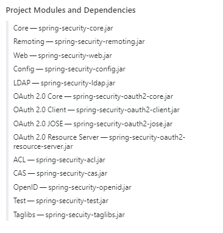
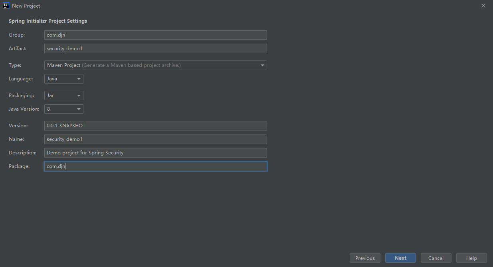
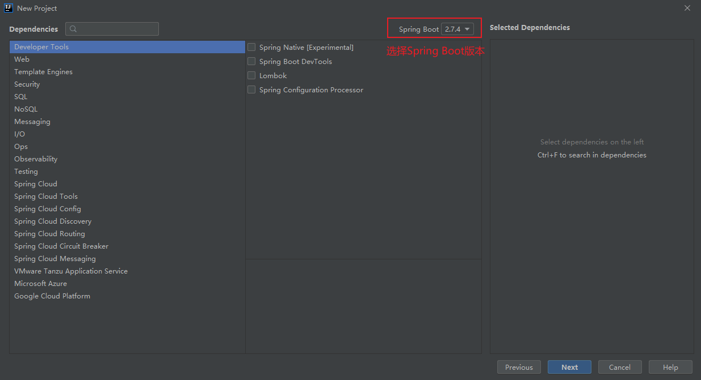

# Spring Security


前置知识：

1、<span style="color:red;">掌握Spring框架</span>

2、<span style="color:#833237;">掌握SpringBoot使用</span>

3、<span style="color:blue;">掌握JavaWeb技术</span>


## 简介

[官方网址](https://spring.io/projects/spring-security)

**概要**

Spring Security基于Spring框架，提供了一套Web应用安全性的完整解决方案。

关于安全方面的两个主要区域是：<strong style="color:blue;">认证</strong> 和 <strong style="color:blue;">授权</strong>（或者访问控制）。

一般来说，Web应用的安全性包括 <strong style="color:red;">用户认证 Authentication</strong> 和 <strong style="color:red;">用户授权Authorization</strong> 两部分，这也是Spring Security的核心功能。

（1）用户认证

验证某个用户是否为系统中的合法主体，也就是说用户能否访问该系统。

用户认证一般要求用户提供用户名和密码，系统通过校验用户名和密码来完成认证。

<span style="color:blue;">通俗点说，就是系统任务用户是否能登录</span>

（2）用户授权

验证用户是否有权限执行某个操作。

在一个系统中，不同用户所具有的权限是不同的。

一般来说，系统会为不同的用户分配不同的角色，而每个角色则对应一系列的权限。

<span style="color:blue;">通俗点说，就是系统判断用户是否有权限去做某些事情</span>


**同款产品对比**

`Spring Security`

- 和Spring无缝整合
- 全面的权限控制
- 专门为Web开发而设计
  - 旧版本不能脱离Web环境使用
  - 新版本对整个框架进行了分层抽取，分成了核心模块和Web模块。（单独引入核心模块就可以脱离Web环境）
- 重量级框架（依赖于很多其他组件，另外里面需要引入各种依赖）


`Shiro`

Apache旗下的轻量级权限控制框架

- 轻量级。Shiro主张的理念是把复杂的事情变简单，针对 *对性能有更高要求的互联网应用* 有更好表现
- 通用性
  - 好处：不局限于Web环境，可以脱离Web环境使用
  - 缺陷：在Web环境下一些特定的需求需要手动编写代码定制


==常见的安全管理技术栈的组合有==：

- SSM + Shiro
- Spring Boot / Spring Cloud + Spring Security


**模块划分**




## 入门案例

第一步 创建Spring Boot工程







第二步 引入相关依赖

```xml
<dependency>
    <groupId>org.springframework.boot</groupId>
    <artifactId>spring-boot-starter-security</artifactId>
</dependency>
```


第三步 编写Controller进行测试