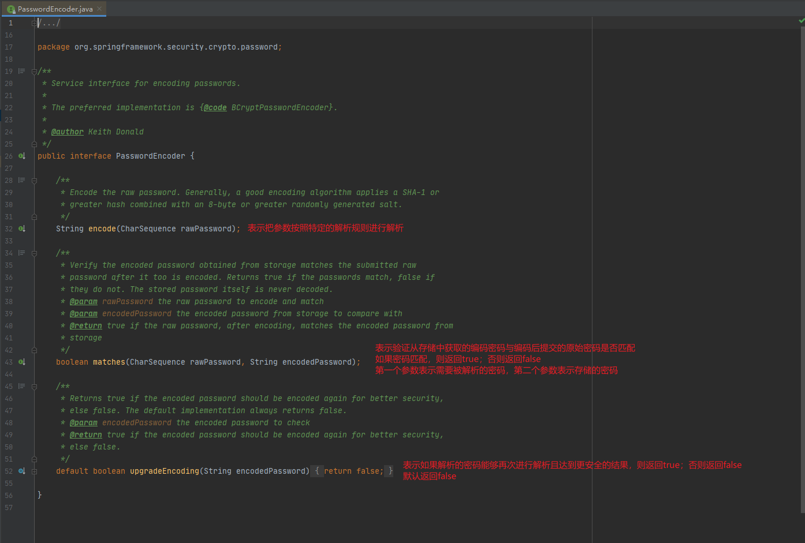

# Spring Security


前置知识：

1、<span style="color:red;">掌握Spring框架</span>

2、<span style="color:#833237;">掌握SpringBoot使用</span>

3、<span style="color:blue;">掌握JavaWeb技术</span>


## 简介

[官方网址](https://spring.io/projects/spring-security)

**概要**

Spring Security基于Spring框架，提供了一套Web应用安全性的完整解决方案。

关于安全方面的两个主要区域是：<strong style="color:blue;">认证</strong> 和 <strong style="color:blue;">授权</strong>（或者访问控制）。

一般来说，Web应用的安全性包括 <strong style="color:red;">用户认证 Authentication</strong> 和 <strong style="color:red;">用户授权Authorization</strong> 两部分，这也是Spring Security的核心功能。

（1）用户认证

验证某个用户是否为系统中的合法主体，也就是说用户能否访问该系统。

用户认证一般要求用户提供用户名和密码，系统通过校验用户名和密码来完成认证。

<span style="color:blue;">通俗点说，就是系统任务用户是否能登录</span>

（2）用户授权

验证用户是否有权限执行某个操作。

在一个系统中，不同用户所具有的权限是不同的。

一般来说，系统会为不同的用户分配不同的角色，而每个角色则对应一系列的权限。

<span style="color:blue;">通俗点说，就是系统判断用户是否有权限去做某些事情</span>


**同款产品对比**

`Spring Security`

- 和Spring无缝整合
- 全面的权限控制
- 专门为Web开发而设计
  - 旧版本不能脱离Web环境使用
  - 新版本对整个框架进行了分层抽取，分成了核心模块和Web模块。（单独引入核心模块就可以脱离Web环境）
- 重量级框架（依赖于很多其他组件，另外里面需要引入各种依赖）


`Shiro`

Apache旗下的轻量级权限控制框架

- 轻量级。Shiro主张的理念是把复杂的事情变简单，针对 *对性能有更高要求的互联网应用* 有更好表现
- 通用性
  - 好处：不局限于Web环境，可以脱离Web环境使用
  - 缺陷：在Web环境下一些特定的需求需要手动编写代码定制


==常见的安全管理技术栈的组合有==：

- SSM + Shiro
- Spring Boot / Spring Cloud + Spring Security


**模块划分**


## 入门案例

第一步 创建Spring Boot工程


第二步 引入相关依赖

```xml
<!--需要导入web场景的启动器，否则项目在启动运行后会立即结束并退出-->
<dependency>
    <groupId>org.springframework.boot</groupId>
    <artifactId>spring-boot-starter-web</artifactId>
</dependency>

<dependency>
    <groupId>org.springframework.boot</groupId>
    <artifactId>spring-boot-starter-security</artifactId>
</dependency>
```


第三步 编写Controller进行测试

```java
package com.djn.controller;

import org.springframework.web.bind.annotation.GetMapping;
import org.springframework.web.bind.annotation.RequestMapping;
import org.springframework.web.bind.annotation.RestController;

/**
 * Name: TestController
 * Description: 测试控制器
 * Copyright: Copyright (c) 2022 MVWCHINA All rights Reserved
 * Company: 江苏医视教育科技发展有限公司
 *
 * @author 丁佳男
 * @version 1.0
 * @since 2022-09-26 17:59
 */
@RestController
@RequestMapping("/test")
public class TestController {

    @GetMapping("/hello")
    public String add() {
        return "Hello Security";
    }
}
```


第四步 在浏览器中访问http://localhost:8899/test/hello，画面如下


出现这个页面说明我们引入的Spring Security已经生效了

**此时我们需要使用Spring Security默认的用户名“user”去登录**

密码在IDEA项目运行着的控制台中查看


### 基本原理

#### 过滤器链

<strong style="color:blue;">Spring Security的本质是一个过滤器链</strong>，有很多过滤器

通过源码，重点查看三个过滤器

**FilterSecurityInterceptor**：<span style="color:green;">这是一个方法级的权限过滤器，基本位于过滤器链的最底部</span>


`super.beforeInvocation(fi)`

- 表示在执行前查看上一个filter是否通过

`filterInvocation.getChain().doFilter(filterInvocation.getRequest(), filterInvocation.getResponse())`

- 表示真正的调用后台的服务


**ExceptionTranslationFilter**：<span style="color:blue;">是一个异常过滤器，用来处理在认证授权过程中抛出的异常</span>


**UsernamePasswordAuthenticationFilter**：<span style="color:red;">对/login的POST请求做拦截，校验表单中的用户名、密码</span>


#### 过滤器加载过程

过滤器是如何进行加载的？

①使用Spring Security，首先要配置过滤器代理 **DelegatingFilterProxy**（在SpringBoot中，这一步被自动化配置代替，所以省略了）

在过滤器代理 **DelegatingFilterProxy** 中的 *doFilter()* 方法中，通过调用初始化方法 *initDelegate()* 得到过滤器链代理 **FilterChainProxy**


②在过滤器链代理 **FilterChainProxy** 中，通过 *doFilterInternal()* 方法得到所有的过滤器，加载到过滤器链中


#### 两个重要的接口

##### UserDetailsService

​    当什么也没有配置的时候，账号和密码是由Spring Security定义生成的。

​    而在实际项目中账号和密码都是从数据库中查询出来的，所以我们要通过自定义逻辑控制**认证逻辑**。

​    如果需要自定义认证逻辑，只需要实现 **UserDetailsService** 接口即可。


​    **UserDetailsService**接口中只有一个 *loadUserByUsername()* 方法，我们把查询数据库用户名和密码的过程写在这个方法中。

​    ==方法参数 *username* 表示用户名，此值是客户端表单传递过来的数据，默认情况下必须叫username，否则无法接收。==

```java
public interface UserDetailsService {
    UserDetails loadUserByUsername(String username) throws UsernameNotFoundException;
}
```

​    *loadUserByUsername()* 方法的返回值：**UserDetails**，是系统默认的用户“主体”（接口）

```java
//表示获取登录用户的所有权限
Collection<? extends GrantedAuthority> getAuthorities();

//表示获取密码
String getPassword();

//表示获取用户名
String getUsername();

//表示判断账户是否过期
boolean isAccountNonExpired();

//表示判断账户是否被锁定
boolean isAccountNonLocked();

//表示凭证（密码）是否过期
boolean isCredentialsNonExpired();

//表示当前用户是否可用
boolean isEnabled();
```

​    以下是**UserDetails**实现类


​    以后我们只需要使用**User**这个实体类即可


###### UserDetailsService使用步骤

①创建类继承 **UsernamePasswordAuthenticationFilter**，重写三个方法（attemptAuthentication、successfulAuthentication、unsuccessfulAuthentication）

②创建类实现 **UserDetailsService**，编写查询数据库的过程，返回User对象（是安全框架提供的对象）


##### PasswordEncoder



**BCryptPasswordEncoder**是Spring Security官方推荐的密码解析器，平时多使用这个解析器。

**BCryptPasswordEncoder**是对bcrypt强散列方法的具体实现。是基于Hash算法实现的单向加密。可以通过strength控制加密强度，默认10。


###### BCryptPasswordEncoder使用案例

```java
@Test
public void test01() {
    //创建密码解析器
    val encoder = new BCryptPasswordEncoder();
    //对密码进行加密
    String stone = encoder.encode("stone");
    //打印密码密文
    System.out.println("密文：" + stone);
    //判断明文密码与密文密码是否匹配
    boolean matchResult = encoder.matches("stone", stone);
    //打印匹配结果
    System.out.println("匹配结果：" + matchResult);
}
```


## Web权限方案

web开发中，如何使用Spring Security做到**认证**和**授权**？

### 一、认证

#### 1.设置登录的用户名和密码

方式一：通过配置文件配置

```properties
spring.security.user.name=SpringStone
spring.security.user.password=1234
spring.security.user.roles=admin
```

方式二：通过配置类实现

```java
/**
 * Name: SecurityConfig
 * Description: 【Spring Security配置类】
 * Copyright: Copyright (c) 2022 MVWCHINA All rights Reserved
 * Company: 江苏医视教育科技发展有限公司
 * 
 * @author 丁佳男
 * @version 1.0
 * @since 2022/10/7 19:11
 */
@Configuration
public class SecurityConfig {

    /**
     * 向Spring容器中注入 UserDetailsService
     *
     * @return org.springframework.security.core.userdetails.UserDetailsService
     * @date 2022/10/7 19:15
     */
    @Bean
    public UserDetailsService getUserDetailsService() {
        BCryptPasswordEncoder encoder = new BCryptPasswordEncoder();
        String encode = encoder.encode("1111");
        InMemoryUserDetailsManager users = new InMemoryUserDetailsManager();
        users.createUser(
                User.withUsername("SpringStone")
                        .password(encode)
                        .roles("admin")
                        .build()
        );
        return users;
    }

    /**
     * 向Spring容器中注入 PasswordEncoder
     *
     * @return org.springframework.security.crypto.password.PasswordEncoder
     * @date 2022/10/7 19:13
     */
    @Bean
    public PasswordEncoder getPasswordEncoder() {
        return new BCryptPasswordEncoder();
    }
}
```

方式三：编写自定义实现类

①创建配置类，注入**PasswordEncoder**

```java
@Configuration
public class SecurityCustomConfig {

    @Bean("bCryptPwdEncoder")
    public PasswordEncoder getPasswordEncoder() {
        return new BCryptPasswordEncoder();
    }
}
```

②编写实现类，返回User对象，User对象有用户名、密码和操作权限

```java
@Service
public class MyUserDetailsService implements UserDetailsService {

    @Resource
    private PasswordEncoder bCryptPwdEncoder;

    @Override
    public UserDetails loadUserByUsername(String username) throws UsernameNotFoundException {
        List<GrantedAuthority> authorities =
                AuthorityUtils.commaSeparatedStringToAuthorityList("admin,user");
        return new User(username, bCryptPwdEncoder.encode("8888"), authorities);
    }
}
```

#### 2.查询数据库完成认证

在Spring Boot中整合Mybatis，完成自定义登录

①创建数据库和数据库表

```sql
CREATE TABLE `security_user` (
  `id` int(11) NOT NULL AUTO_INCREMENT COMMENT '主键',
  `username` varchar(100) DEFAULT NULL COMMENT '用户名',
  `password` varchar(100) DEFAULT NULL COMMENT '密码',
  PRIMARY KEY (`id`)
) ENGINE=InnoDB DEFAULT CHARSET=utf8;
```

②创建对应的实体类，编写Mapper查询数据库

……略

③在自定义实现类中调用查询方法，查询用户信息

```java
@Resource
private UserMapper userMapper;

@Override
public UserDetails loadUserByUsername(String username) throws UsernameNotFoundException {
    //查询数据库
    val user = userMapper.selectUserByName(username);
    //判断用户是否存在
    if (user == null) throw new UsernameNotFoundException("用户不存在！");
    //设置用户权限，后面会从数据库查
    List<GrantedAuthority> authorities =
        AuthorityUtils.commaSeparatedStringToAuthorityList("admin,user");
    //根据查到的用户生成Security中的User对象，并返回
    return new User(user.getUsername(), bCryptPwdEncoder.encode(user.getPassword()), authorities);
}
```

==注意==：

这里的用户查询不需要加密码，

是因为我们在查到用户之后会封装成Security中的User对象并返回，

Security拿到该对象会使用内置的默认验证方法去进行密码验证（用User中的密码和我们输入的密码进行加密匹配）

#### 3.自定义用户登录页面

<span style="color:blue;">同时配置放行路径</span>，只需要：

①在配置类中实现相关的配置

```java
/**
 * Name: SecurityConfig
 * Description: Spring Security配置类
 * Copyright: Copyright (c) 2022 MVWCHINA All rights Reserved
 * Company: 江苏医视教育科技发展有限公司
 *
 * @author 丁佳男
 * @version 1.0
 * @since 2022/10/7 19:11
 */
@Configuration
@EnableWebSecurity
public class SecurityConfig implements WebMvcConfigurer {

    /**
     * 向Spring容器中注入 UserDetailsService
     *
     * @return org.springframework.security.core.userdetails.UserDetailsService
     * @date 2022/10/7 19:15
     */
    // @Bean
    public UserDetailsService getUserDetailsService() {
        BCryptPasswordEncoder encoder = new BCryptPasswordEncoder();
        String encode = encoder.encode("1111");
        InMemoryUserDetailsManager users = new InMemoryUserDetailsManager();
        users.createUser(
                User.withUsername("SpringStone")
                        .password(encode)
                        .roles("admin")
                        .build()
        );
        return users;
    }

    /**
     * 向Spring容器中注入 PasswordEncoder
     *
     * @return org.springframework.security.crypto.password.PasswordEncoder
     * @date 2022/10/7 19:13
     */
    @Bean
    public PasswordEncoder getPasswordEncoder() {
        return new BCryptPasswordEncoder();
    }

    /**
     * 向Spring容器中注入 SecurityFilterChain
     * （*************特别声明：此处 HttpSecurity 需要通过 @EnableWebSecurity注解 注册到Spring容器中，才能获取到**************）
     *
     * @param http HttpSecurity 一个HTTP安全策略配置器
     * @return org.springframework.security.web.SecurityFilterChain
     * @date 2022/10/9 20:30
     */
    @Bean
    public SecurityFilterChain getSecurityFilterChain(HttpSecurity http) throws Exception {
        http.formLogin()    //自定义登录页面
                .loginPage("/login.html")   //设置登录页
                .loginProcessingUrl("/user/login")  //设置登录访问路径
                .defaultSuccessUrl("/test/index")   //设置登录成功之后，默认跳转路径
                .permitAll()    //设置访问权限级别：全部允许
                .and()
                .authorizeRequests()    //请求授权（设置哪些路径可以不需要登录直接访问）
                .antMatchers("/", "/test/hello") //设置匹配的路径
                .permitAll()    //设置访问权限级别：全部允许
                .anyRequest().authenticated()   //限制任何请求必须是“被认证的”
                .and()
                .csrf().disable()   //关闭CSRF防护
        ;
        return http.build();
    }
}
```

②创建相关的页面和Controller

登录页面放在`resource/static`下


### 二、授权

#### 1.基于权限访问控制

==hasAuthority方法==：如果当前的主体具有指定的权限，则返回true；否则返回false

①在配置类中给访问地址设置权限限制

```java
//当前登录用户，只有具有admin权限才可以访问这个路径
.antMatchers("/test/index").hasAuthority("admin")
```

②在自定义实现类（MyUserDetailsService）中，为返回的User对象设置权限

```java
//设置用户权限，后面会从数据库查
List<GrantedAuthority> authorities =
    AuthorityUtils.commaSeparatedStringToAuthorityList("admin,user");
```

==hasAnyAuthority方法==：如果当前主体有提供的权限列表中的任意一个的话，返回true

①在配置类中给访问地址设置允许访问的权限列表

```java
//当前登录用户，具有提供的权限列表中的任一权限即可访问这个路径
.antMatchers("/test/index").hasAnyAuthority("admin", "user", "visitor")
```

②同上

==hasRole方法==：如果当前主体具备指定角色，则返回true（如果用户具备给定角色就允许访问，否则返回403状态码）

①在配置类中给访问地址设置角色限制

```java
//当前登录的用户，只有是sale角色时才可以访问这个路径
.antMatchers("/test/index").hasRole("sale")
```

②在自定义实现类（MyUserDetailsService）中，为返回的User对象设置角色

```java
//设置用户权限，后面会从数据库查
List<GrantedAuthority> authorities =
    AuthorityUtils.commaSeparatedStringToAuthorityList("admin,user,ROLE_sale");
```

<strong style="color:red;">注意：角色会加上 `ROLE_` 前缀用以区分权限，从源码可知</strong>


==hasAnyRole方法==：如果当前主体是提供的角色列表中的任意一个的话，返回true

①在配置类中给访问地址设置允许访问的角色列表

```java
//当前登录用户，是提供的角色列表中的任意角色即可访问这个路径
.antMatchers("/test/index").hasAnyRole("sale", "manage")
```

②在自定义实现类（MyUserDetailsService）中，为返回的User对象设置角色

```java
//设置用户权限，后面会从数据库查
List<GrantedAuthority> authorities =
    AuthorityUtils.commaSeparatedStringToAuthorityList("admin,user,ROLE_sale,ROLE_manage");
```

#### 2.自定义403页面

```java
//自定义没有访问权限时的跳转页面
http.exceptionHandling().accessDeniedPage("/unauth.html");
```

自定义403页面

```html
<!DOCTYPE html>
<html lang="en">
    <head>
        <meta charset="UTF-8">
        <title>没有权限</title>
    </head>
    <body>
        <h1>没有访问权限！</h1>
    </body>
</html>
```

#### 3.注解使用

<span style="color:blue;">使用注解先要开启注解功能</span>

```java
@SpringBootApplication
@EnableGlobalMethodSecurity(securedEnabled = true)
public class SecurityDemo1Application {

    public static void main(String[] args) {
        SpringApplication.run(SecurityDemo1Application.class, args);
    }

}
```

##### @secured

 判断是否具有角色（<span style="color:red;">注意：这里匹配的字符串需要添加前缀“`ROLE_`”</span>）


##### @PreAuthorize


##### @PostAuthorize


##### @PostFilter


##### @PreFilter


##### 权限表达式
